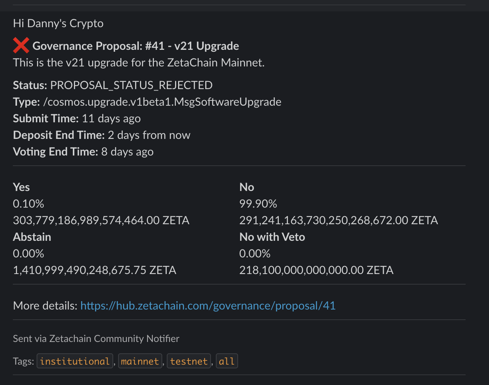
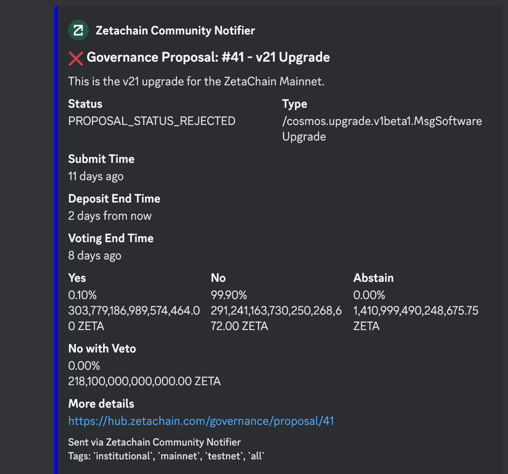
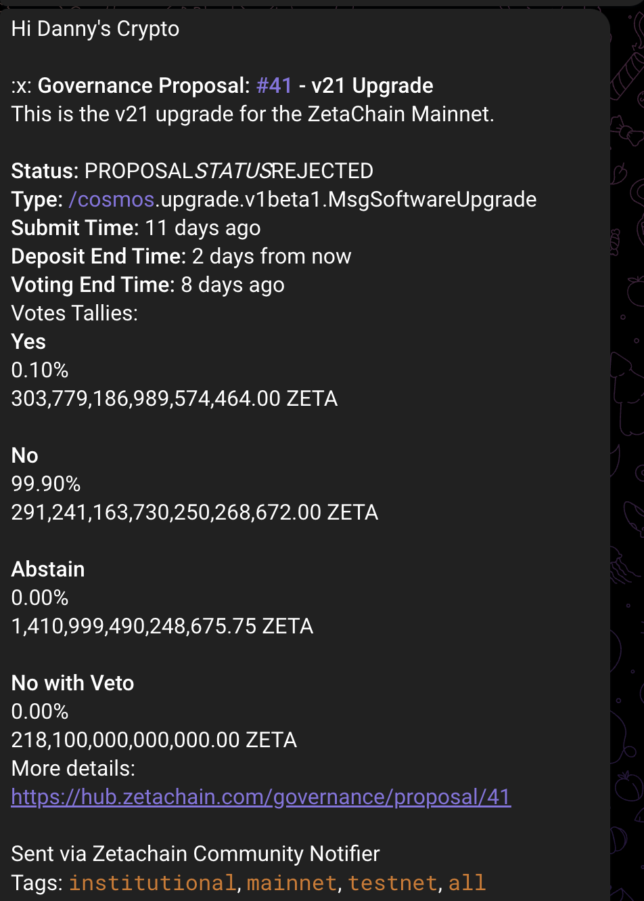

# Community Notifier

Work in progress on making it pretty, but it works.

## Setup

1. Clone the repository.
2. Install `uv` as per https://docs.astral.sh/uv/
3. Configure your API keys & Webhooks in `notifier/config.yaml`.

~~~yaml
avatar_url: "https://avatars.githubusercontent.com/u/86979844?s=200&v=4"
humanize_datetime: true

statuspages:
  - enabled: true
    name: "FrobergCo Status"
    api_key: "your_statuspage_api_key"
    page_id: "your_statuspage_page_id"
  - enabled: false
    name: "Zetachain Status"
    api_key: "customer2_statuspage_api_key"
    page_id: "customer2_statuspage_page_id"

customers:
  - enable: true
    name: "Danny's Crypto"
    groups: ["institutional", "mainnet", "testnet", "all"]
    discord:
      enabled: true
      webhook_url: "https://discord.com/api/webhooks/your_discord_webhook_url"
    slack:
      enabled: true
      webhook_url: "https://hooks.slack.com/services/your_slack_webhook_url"
    telegram:
      enabled: true
      bot_token: "your_telegram_bot_token"
      chat_id: "@your_telegram_channel"  # or "your_chat_id"
    statuspage:
      enabled: false
      api_key: ""
      page_id: ""
  - enable: false
    name: "Zetachain SREs"
    groups: ["institutional", "mainnet", "testnet", "all"]
    discord:
      enabled: false
      webhook_url: ""
    slack:
      enabled: true
      webhook_url: "https://hooks.slack.com/services/your_slack_webhook_url"
    telegram:
      enabled: false
      bot_token: "customer2_telegram_bot_token"
      chat_id: "customer2_telegram_chat_id"
    statuspage:
      enabled: false
      api_key: "customer2_statuspage_api_key"
      page_id: "customer2_statuspage_page_id"
~~~

4. Run the main script to send notifications:

```sh
cd notifier
uv run main.py [--once|--watch]
```

## Examples

### Slack


### Discord


### Telegram

