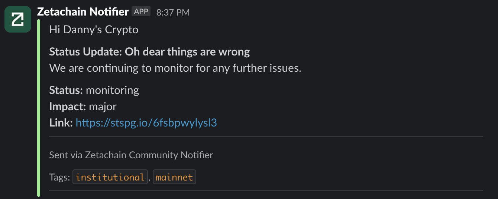
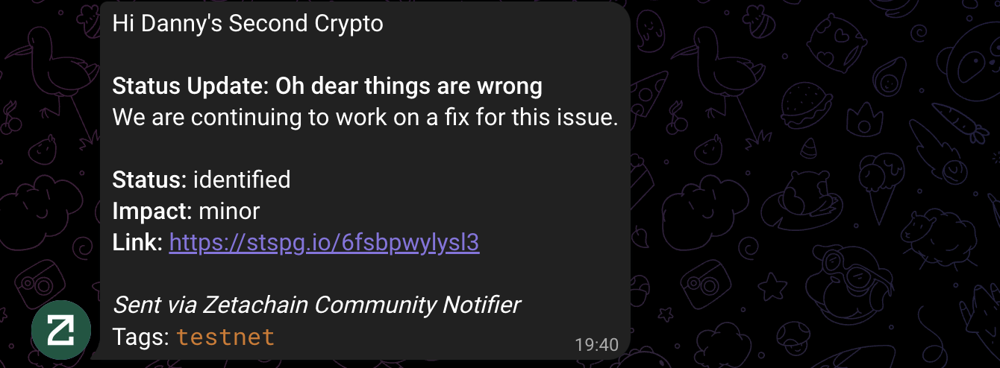
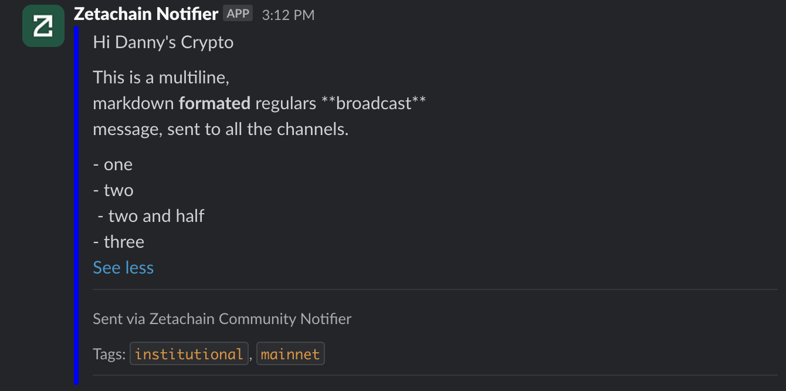
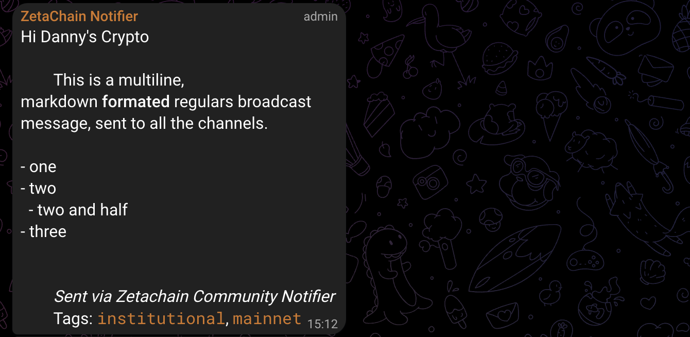
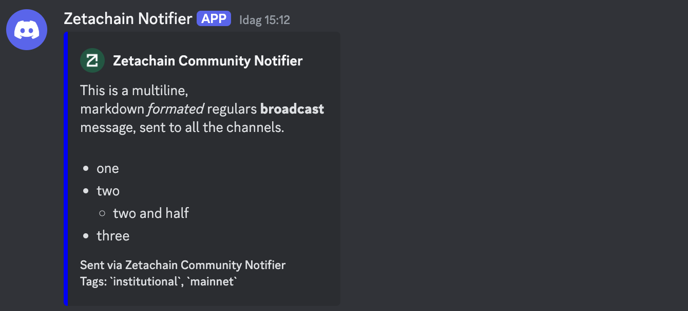
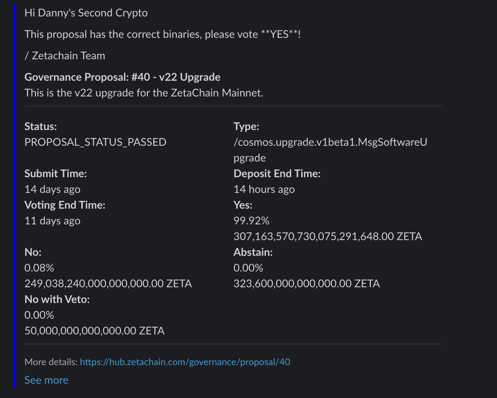
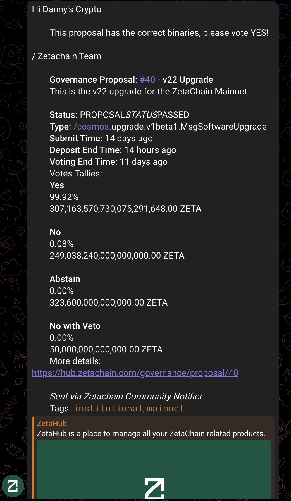
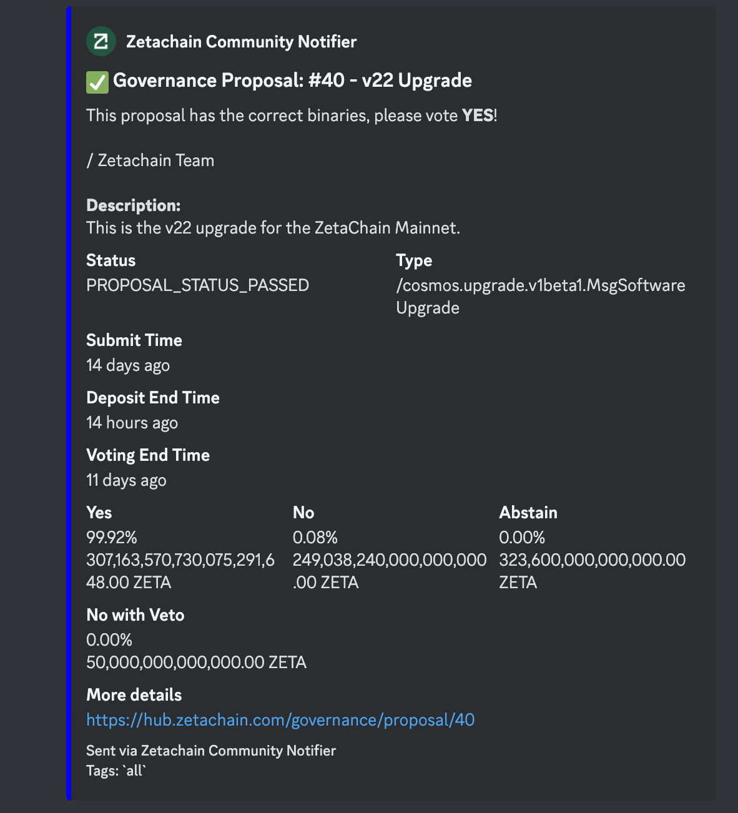

# Zetachain Community Notifier

Work in progress on making it pretty, but it works.

Artifacts for mac & linux (ubuntu) are stored in the github workflow runs.

## Setup

1. Clone the repository.
2. Install 
    - Required:
        - `brew install pre-commit` # for macOS
        - `pip install pre-commit` # for Linux
        - `uv` as per https://docs.astral.sh/uv/
    - Optional (This is reformed in GHA)
        - `uv pip install -U pyinstaller` to create a standalone executables
3. Configure your API keys & Webhooks in `notifier/config.yaml`.

~~~yaml
avatar_url: "https://avatars.githubusercontent.com/u/86979844?s=200&v=4"

statuspages:
  - enabled: true
    name: "FrobergCo Status"
    api_key: "your_statuspage_api_key"
    page_id: "your_statuspage_page_id"
  - enabled: false
    name: "Zetachain Status"
    api_key: "customer2_statuspage_api_key"
    page_id: "customer2_statuspage_page_id"

customers:
  - enable: true
    name: "Danny's Crypto"
    groups: ["institutional", "mainnet", "testnet", "all"]
    discord:
      enabled: true
      webhook_url: "https://discord.com/api/webhooks/your_discord_webhook_url"
    slack:
      enabled: true
      webhook_url: "https://hooks.slack.com/services/your_slack_webhook_url"
    telegram:
      enabled: true
      bot_token: "your_telegram_bot_token"
      chat_id: "@your_telegram_channel"  # or "your_chat_id"
    statuspage:
      enabled: false
      api_key: ""
      page_id: ""
  - enable: false
    name: "Zetachain SREs"
    groups: ["institutional", "mainnet", "testnet", "all"]
    discord:
      enabled: false
      webhook_url: ""
    slack:
      enabled: true
      webhook_url: "https://hooks.slack.com/services/your_slack_webhook_url"
    telegram:
      enabled: false
      bot_token: "customer2_telegram_bot_token"
      chat_id: "customer2_telegram_chat_id"
    statuspage:
      enabled: false
      api_key: "customer2_statuspage_api_key"
      page_id: "customer2_statuspage_page_id"
~~~

4. Run the main script to send notifications:

```sh
cd notifier
uv run main.py [--once|--watch] [--override-date-filter]
```

# Usage

~~~sh
usage: main.py [-h] [--override-date-filter] [--once] [--watch]

Notifier script for ZetaChain updates and proposals

optional arguments:
  -h, --help            show this help message and exit
  --override-date-filter
                        Override date filter and send the latest update and proposal regardless of date
  --once                Run the script once and exit
  --watch               Keep the script running and check for updates every 30 seconds
  --loglevel {debug,info,warning,error,critical}
                        Set the logging level
~~~

## Example Run

~~~
2024-11-17 11:42:46.724 | INFO     | __main__:<module>:214 - Starting notifier script
2024-11-17 11:42:46.724 | INFO     | __main__:load_sent_updates:34 - Loaded sent updates from pickle file
2024-11-17 11:42:47.060 | INFO     | __main__:fetch_status_updates:49 - Fetched status updates
2024-11-17 11:42:47.231 | INFO     | __main__:fetch_governance_proposals:77 - Fetched governance proposals
2024-11-17 11:42:47.234 | INFO     | __main__:main:181 - Override date filter: Sending the latest update and proposal regardless of date
2024-11-17 11:42:47.503 | INFO     | discord_notifier:send_discord_message:56 - Sent Discord message with status code 204
2024-11-17 11:42:47.504 | INFO     | __main__:notify_customer:133 - Sent Discord message to Danny's Crypto
2024-11-17 11:42:47.871 | INFO     | slack_notifier:send_slack_message:93 - Sent Slack message with status code 200
2024-11-17 11:42:47.872 | INFO     | __main__:notify_customer:138 - Sent Slack message to Danny's Crypto
2024-11-17 11:42:48.246 | INFO     | telegram_notifier:send_telegram_message:44 - Sent Telegram message with message_id 39
2024-11-17 11:42:48.248 | INFO     | __main__:notify_customer:143 - Sent Telegram message to Danny's Crypto
2024-11-17 11:42:48.248 | INFO     | __main__:main:192 - Notified Danny's Crypto about status update This is an example incident
2024-11-17 11:42:48.479 | INFO     | discord_notifier:send_discord_message:56 - Sent Discord message with status code 204
2024-11-17 11:42:48.479 | INFO     | __main__:notify_customer:153 - Sent Discord message to Danny's Crypto
2024-11-17 11:42:48.768 | INFO     | slack_notifier:send_slack_message:93 - Sent Slack message with status code 200
2024-11-17 11:42:48.769 | INFO     | __main__:notify_customer:158 - Sent Slack message to Danny's Crypto
2024-11-17 11:42:49.016 | INFO     | telegram_notifier:send_telegram_message:44 - Sent Telegram message with message_id 40
2024-11-17 11:42:49.020 | INFO     | __main__:notify_customer:163 - Sent Telegram message to Danny's Crypto
2024-11-17 11:42:49.020 | INFO     | __main__:main:200 - Notified Danny's Crypto about governance proposal v21 Upgrade
2024-11-17 11:42:49.021 | INFO     | __main__:save_sent_updates:42 - Saved sent updates to pickle file
2024-11-17 11:42:49.021 | INFO     | __main__:<module>:221 - Notifier script finished
~~~

## Examples

### Automated Zetachain Proposal Updates

the notifier watches the Zetachain for gorvenance proposals and sends a notification to the specified channels.

#### To Slack


#### To Discord


#### To Telegram


### Automated Zetachain Incident Updates

The notifier watches the Zetachain statuspage and send incidents and updates to the specified channels.

#### To Statuspage Incident Upstream


#### To Discord


#### To Slack


#### To Telegram

### Broadcast

Send broadcasts to the specified channels. This uses the API to send a message.

#### To Slack


#### To Telegram


#### To Discord


### Broadcast with Governance Proposal

This uses the the API to send a custom message with an attached governance proposal
to the specified channels.

#### To Slack

#### To Telegram

#### To Discord



## TODO:

- Create configurable templates for notifications
- Unpack more statuspage data with components
- Match customer tags with statuspage components (50%)

## FAQ

- How do I update the requirements.txt manually?
  - You can update the requirements.txt manually by running `uv export --format requirements-txt > requirements.txt`.

## Using broadcast.py (API)

You can use the `broadcast.py` script to send a message to the notifier API. You can specify the component, proposal ID, and message as command-line arguments, and the message can be piped in or entered interactively. The script also supports automatic confirmation of the broadcast message.

### Command-Line Arguments

- `--component`: The component to broadcast the message about (required).
- `--proposal`: The proposal ID (optional).
- `--message`: The message to broadcast (optional, can be piped in).
- `--yes`: Automatically confirm the broadcast message (optional).

### Examples

#### Interactive Input

```sh
uv run broadcast.py --component testnet --proposal 41
```

You will be prompted to enter the message interactively. End the input with `Ctrl-D`.

#### Piped Input

```sh
echo "This is a test message" | uv run broadcast.py --component testnet --proposal 41
```

The message will be read from the piped input.

#### Auto-Confirm

```sh
echo "This is a test message" | uv run broadcast.py --component testnet --proposal 41 --yes
```

The message will be read from the piped input and automatically confirmed.

### Script Details

The script performs the following steps:

1. Parses command-line arguments.
2. Reads the message from the `--message` argument, standard input (if piped), or interactively (if not provided).
3. Displays a preview of the broadcast details.
4. Prompts for confirmation (unless `--yes` is provided).
5. Sends the broadcast message to the notifier API.

### Example Workflow

1. **Run the Script**:
    ```sh
    python broadcast.py --component testnet --proposal 41
    ```

2. **Enter the Message**:
    ```
    Enter the message (end with Ctrl-D):
    This is a test message.
    Another line of the message.
    ```

3. **Preview**:
    ```
    --- Preview ---
    Component: testnet
    Message:
    This is a test message.
    Another line of the message.
    Proposal ID: 41
    ----------------
    ```

4. **Confirmation**:
    ```
    Do you want to send this broadcast? (yes/no or y/n): yes
    ```

5. **Broadcast Sent**:
    ```
    Broadcast sent successfully
    ```

### Error Handling

If the broadcast fails, the script will display an error message with the details of the failure.

```sh
Failed to send broadcast: <error_message>
```
